<!-- ⚡ Generated with love, TypeScript vibes and way too many SVG keyframes -->

<picture>
  <source media="(prefers-color-scheme: dark)" srcset="./assets/hero-dark.svg">
  <source media="(prefers-color-scheme: light)" srcset="./assets/hero-light.svg">
  
</picture>

  

 

##  whoami

<picture>
  <source media="(prefers-color-scheme: dark)" srcset="./assets/terminal-dark.svg">
  <source media="(prefers-color-scheme: light)" srcset="./assets/terminal-light.svg">
  
</picture>

  

## 🚀 Featured

<a href="https://github.com/chevgan/render-peek">
  <picture>
    <source media="(prefers-color-scheme: dark)" srcset="https://raw.githubusercontent.com/chevgan/chevgan/output/pin-render-peek-dark.svg">
    
  </picture>
</a>
<a href="https://github.com/chevgan/react-ai-voice-visualizer">
  <picture>
    <source media="(prefers-color-scheme: dark)" srcset="https://raw.githubusercontent.com/chevgan/chevgan/output/pin-react-ai-voice-visualizer-dark.svg">
    
  </picture>
</a>

🔍 <b>render-peek</b> — a React hook for visually catching unnecessary re-renders &nbsp;·&nbsp; 🎙 <b>react-ai-voice-visualizer</b> — production-ready components for AI voice interfaces with real-time audio visualization

 

⚡ this profile is hand-written animated SVG — no generators · <a href="./assets">view source</a>

